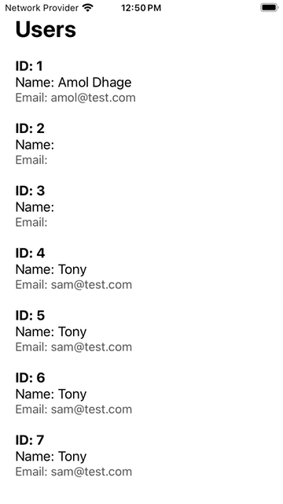
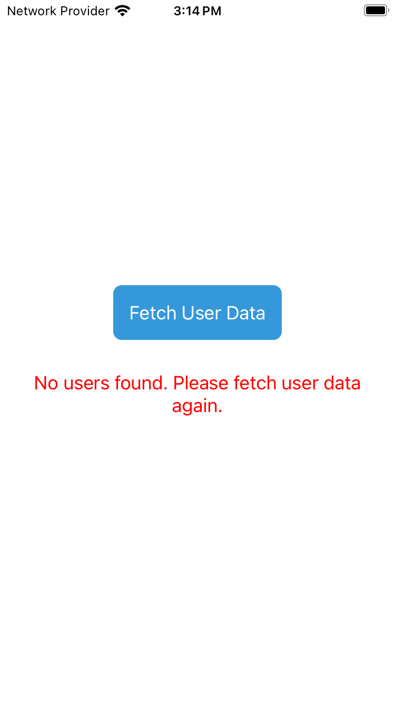
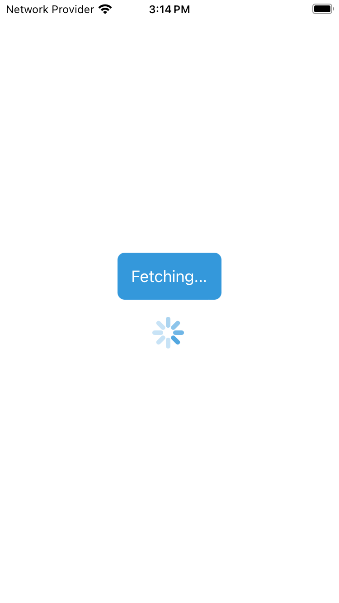
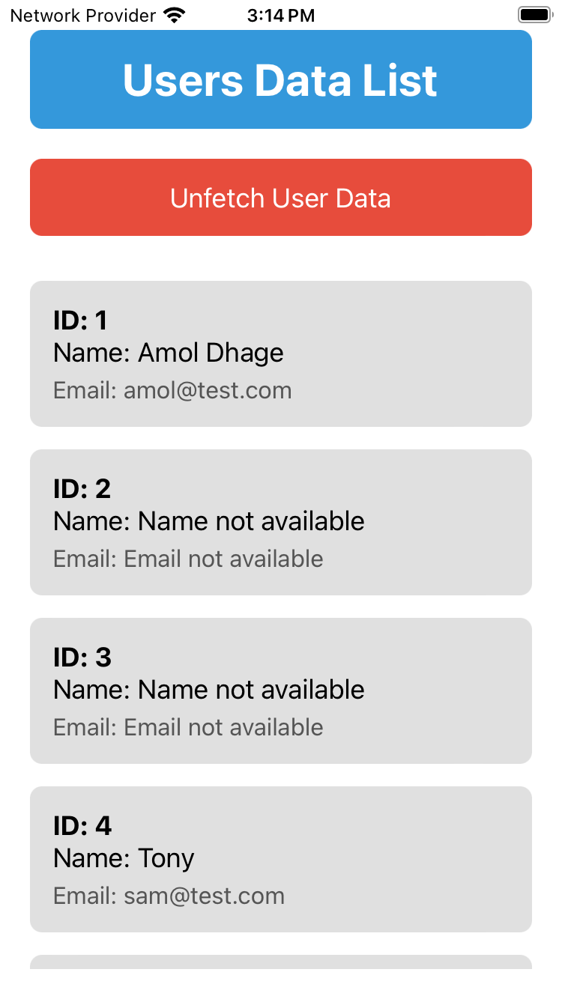

# React Native User Data App

This React Native application fetches and displays user data from a remote server. The app includes features such as fetching user data with a delay, unfetching data, and rendering the user information in a FlatList.

## Table of Contents

- [Getting Started](#getting-started)
- [Demo](#demo)
- [Screenshots](#screenshots)
- [Features](#features)
- [Usage](#usage)
- [Dependencies](#dependencies)

## Getting Started

To run this React Native app, follow these steps:

1. Ensure you have React Native and its dependencies installed on your development machine.
2. Clone this repository.
3. Install project dependencies by running `npm install` in the project root directory.
4. Run the app using `npx react-native run-android` for Android or `npx react-native run-ios` for iOS.

## Demo

<p align="center">
  
</p>

## Screenshots

<p align="center">
  
  
  
</p>

## Features

### 1. Fetch User Data

- The app fetches user data from a remote server using the `fetchUserDataWithDelay` function.
- An Activity Indicator is displayed while fetching data, and the "Fetch User Data" button is disabled during the process.

### 2. Unfetch User Data

- The app allows users to unfetch data using the "Unfetch User Data" button, which resets the data and hides the unfetch button.

### 3. Display User Data

- User data is displayed in a FlatList with each item containing the user's ID, name, and email.
- The app handles cases where user names or emails are not available.

## Usage

- After launching the app, press the "Fetch User Data" button to retrieve user information.
- An Activity Indicator will be displayed while data is being fetched.
- Once data is fetched, a list of users will be shown in a FlatList.
- Press the "Unfetch User Data" button to clear the user data and hide the unfetch button.

## Dependencies

- React
- React Native


This is a new [**React Native**](https://reactnative.dev) project, bootstrapped using [`@react-native-community/cli`](https://github.com/react-native-community/cli).

# Getting Started

>**Note**: Make sure you have completed the [React Native - Environment Setup](https://reactnative.dev/docs/environment-setup) instructions till "Creating a new application" step, before proceeding.

## Step 1: Start the Metro Server

First, you will need to start **Metro**, the JavaScript _bundler_ that ships _with_ React Native.

To start Metro, run the following command from the _root_ of your React Native project:

```bash
# using npm
npm start

# OR using Yarn
yarn start
```

## Step 2: Start your Application

Let Metro Bundler run in its _own_ terminal. Open a _new_ terminal from the _root_ of your React Native project. Run the following command to start your _Android_ or _iOS_ app:

### For Android

```bash
# using npm
npm run android

# OR using Yarn
yarn android
```

### For iOS

```bash
# using npm
npm run ios

# OR using Yarn
yarn ios
```

If everything is set up _correctly_, you should see your new app running in your _Android Emulator_ or _iOS Simulator_ shortly provided you have set up your emulator/simulator correctly.

This is one way to run your app — you can also run it directly from within Android Studio and Xcode respectively.

## Step 3: Modifying your App

Now that you have successfully run the app, let's modify it.

1. Open `App.tsx` in your text editor of choice and edit some lines.
2. For **Android**: Press the <kbd>R</kbd> key twice or select **"Reload"** from the **Developer Menu** (<kbd>Ctrl</kbd> + <kbd>M</kbd> (on Window and Linux) or <kbd>Cmd ⌘</kbd> + <kbd>M</kbd> (on macOS)) to see your changes!

   For **iOS**: Hit <kbd>Cmd ⌘</kbd> + <kbd>R</kbd> in your iOS Simulator to reload the app and see your changes!

## Congratulations! :tada:

You've successfully run and modified your React Native App. :partying_face:

### Now what?

- If you want to add this new React Native code to an existing application, check out the [Integration guide](https://reactnative.dev/docs/integration-with-existing-apps).
- If you're curious to learn more about React Native, check out the [Introduction to React Native](https://reactnative.dev/docs/getting-started).

# Troubleshooting

If you can't get this to work, see the [Troubleshooting](https://reactnative.dev/docs/troubleshooting) page.

# Learn More

To learn more about React Native, take a look at the following resources:

- [React Native Website](https://reactnative.dev) - learn more about React Native.
- [Getting Started](https://reactnative.dev/docs/environment-setup) - an **overview** of React Native and how setup your environment.
- [Learn the Basics](https://reactnative.dev/docs/getting-started) - a **guided tour** of the React Native **basics**.
- [Blog](https://reactnative.dev/blog) - read the latest official React Native **Blog** posts.
- [`@facebook/react-native`](https://github.com/facebook/react-native) - the Open Source; GitHub **repository** for React Native.
